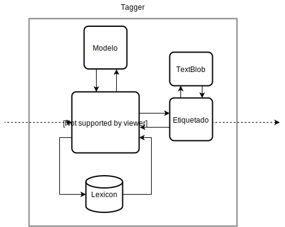

## Tweets controversiales

### Objetivo
Dado un tweet queremos detectar si el mismo es controversial, es decir, si posee respuestas en la que varios usuarios defienden opiniones contrarias, identificando aquellos usuarios que están en contra, a favor, o aquellos que no es posible determinar su postura hacia el tweet.

### Primera aproximación
Uno de los primeros objetivos consiste en etiquetar las respuestas de un tweet dependiendo su opinión. Se definieron las siguientes etiquetas **neutral**, **attack** y **support** el cual van a ser utilizadas para categorizar las distintas posturas.

Para determinar la postura de un tweet se definió un vocabulario inicial el cual llamaremos *lexicon* este contendrá palabras que posiblemente caractericen a las distintas posturas, es decir, *lexicon_attack* inicialmente  tendrá las palabras **mentira** y **falso**.

Luego para detectar que un tweet es controversial, observaremos si algunas de las respuestas tienen al menos una palabra del los *lexicons* definidos.

El segundo objetivo es ampliar el vocabulario de los *lexicons* utilizando Word embedding, y luego volver a etiquetar las respuestas con el vocabulario ampliado.

Por último y como tercer objetivo, se visualizará el resultado obtenido.
 
### Pipeline

Para el desarrollo del proyecto se definió el siguiente procedimiento, que será explicado con mayor detalles.


#### Obtención de Twets
En primer lugar se obtienen tweets sobre un tema controvertido dentro del contexto de las noticias que posee Twitter.
Para la recolección de los tweets se utilizó la herramienta [Twarc](https://github.com/DocNow/twarc), la cual brinda facilidad para obtener tweets con su respectivas respuestas en formato JSON.

#### Preprocesamiento
En el preprocesamiento al tweet se lo transforma en texto en minúscula, y luego se lo tokeniza utilizando la libreria [NLTK](http://www.nltk.org/).
Inicialmente los tweets son etiquetados como **neutral**.

#### Etiquetado



Se definió la siguiente función ```tagged(tweets, root, lexicon, model, n)``` la cual etiqueta las respuestas y amplía el vocabulario. Para ampliar se utilizaron Words embeddings de un modelo pre-entrenado obtenido de SBWCE<sup>1</sup>, el cual vemos las palabras más similares dél modelos con respecto al *lexicon*.

Durante la primera aproximación surge un problema, ¿Que *lexicon* definimos para caracterizar los tweets que están a favor?, ya que es más difícil determinar las palabras que tienden a ser utilizadas para un tweet que está a favor de la opinión. Una solución planteada fue hacer análisis de sentimiento utilizando [TextBlob](https://textblob.readthedocs.io/en/dev/), una libreria para procesamiento del lenguaje natural que tiene como característica la implementación de análisis de sentimientos.

 Esta solución no es buena ya que al hacer análisis de sentimiento estamos decidiendo qué postura tiene el tweet analizándolo sintácticamente,  es decir, si partes del texto están usando lenguaje positivo, negativo o neutral.

#### Visualización
Se utilizo el framework web [flask](https://palletsprojects.com/p/flask/) para desarrollar la visualización de los resultados, diseñando un template imitando la interfaz de usuario de una conversación en Twitter.

### Ampliación del vocabulario
Una alternativa que se propuso para ampliar el vocabulario fue usar el mismo vocabulario de los tweets(dataset), es decir, comparar cada token del tweet con las palabras del *lexicon* usando un modelo pre-entrenado con FastText de [francolq@famaf.unc.edu.ar]() para determinar la similitud de las palabras, por lo tanto si el par es similar usando como métrica un umbral determinado, el token será agregado al *lexicon*.
 


donde *u* denota al umbral elegido.

### Resultados

Se definió un *lexicon esperado*

['mentira', 'mentiroso', 'falso', 'mentirosa', 'verdad', 'verdadero', 'engañoso', 'mentir', 'engaño', 'fraude', 'mentiras']

El cual servirá para comparar las distintos resultados del ampliación del vocabulario.

Dado ```lexicon_attack = ['falso', 'mentira']```

Se obtuvieron los siguientes resultados de la ampliación del vocabulario mediante la primera aproximación utilizando el modelo de word2vec y la propuesta alternativa utilizando el modelo de fastText.

| Iteracion | Modelo w2v | Modelo FastText |
| --- | --- | --- |
| 0 | falso mentira | falso mentira |
| 1 | falso mentira falsa mentirilla verdad fraudulencia engaño infundio mentiras andrómina patraña encubriéndola | falso mentira verdad realmente mentiroso mentiiira miente mentir |
| 2 | falso mentira falsa mentirilla verdad fraudulencia engaño infundio mentiras andrómina patraña encubriéndola embaucamiento inauténtica mangancia autocondena extrañándose tacharme trola fechorias trocaré desverguenza | falso mentira verdad realmente mentiroso mentiiira miente mentir mienten mentirosos caradura mientan mitomanos hipocritas digan macristas ladrones buitres k delincuentes basuras chorros macrisis caraduras gobierno offshore intereses fmi estafadores ineptos sarta justicia irresponsables cristina aumento macri kk presidente mauricio robaron kristina crisis presos jueces militantes afanan soretes mafiosos bcra oposición legislatura manga ignorantes bonos idiotas deuda estafador presi ministerios macrismo verguenzas peronista justicialista vice peronia presa afanó  |

Como podemos observar el vocabulario en la segunda iteración de la propuesta alternativa es más extenso con respecto a la segunda iteración de la primera aproximación. Analizando las palabras agregadas, se obtuvo más conformidad con la primera aproximación.

### Problemas
Un problema principal que se presentó en el procedimiento fue la recolección de los tweet con sus respectivas respuestas, ya que la API de Twitter no posee esta funcionalidad. Una primera solución fue scrappear Twitter, por último se utilizó Twarc.

Otro problema fue mencionado en la sección de etiquetado, sobre el *lexicon* para tweets a favor.

### Resumen, Conclusiones y Trabajo futuro

### Instalación y uso
Instalación de requerimientos

```pip install -r requirements.txt```

Instalación del paquete Tweet

```pip install package/dist/tweet-0.1.tar.gz```

Obtención de tweets

```twarc replies <id_tweet> --recursive > data/<file_name>.json```

Visualización

```cd visualization/ && flask run```

### Referencias
1.[Cristian Cardellino: Spanish Billion Words Corpus and Embeddings (March 2016)]( https://crscardellino.github.io/SBWCE/).
2.[Analyzing the Semantic Types of Claims and Premises in an Online Persuasive Forum, Christopher  and Musi, Elena  and Hwang, Alyssa  and Muresan, Smaranda  and McKeown, Kathy (2017)](https://www.aclweb.org/anthology/W17-5102)
