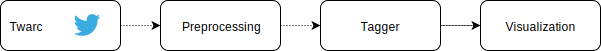

## Tweets controversiales

### Objetivo
Dado un tweet queremos detectar si el mismo es controversial, es decir, si posee respuestas en la que varios usuarios defienden opiniones contrarias. Identificando aquellos usuarios que estan en contra, a favor, o aquellos que no es posible determinar su postura hacia el tweet.

### Primera aproximación
Uno de los primeros objetivos consiste en etiquetar las respuestas de un tweet dependiendo su opinion. Se definieron las siguientes etiquetas **neutral**, **attack** y **support** el cual van a ser utilizadas para categorizar las distintas posturas.

Para determinar la postura de un tweet se definio un vocabulario inicial el cual llamaremos *lexicon* este contendra palabras que posiblemente caractericen a las distintas posturas, es decir, *lexicon_attack* inicialmente  tendra las palabras **mentira** y **falso**.

Luego para detectar que un tweet es controversial, observaremos si algunas de las repuestas tienen al menos una palabra del los *lexicons* definidos.

El segundo objetivo es ampliar el vocabulario de los *lexicons* utilizando Word embedding, y luego volver a etiquetar las respuestas con el vocabulario ampliado.

Por ultimo y como tercer objetivo, se visualizara el resultado obtenido.
  
### Arquitectura



#### Obtencion de Twets
Para la recoleción de los tweets se utilizo la herramienta [Twarc](https://github.com/DocNow/twarc), la cual brinda facilidad para obtener tweets con su respectivas respuestas en formato JSON.

#### Preprocesamiento
En el preprocesamiento al tweet se lo transforma en texto en minuscula, y luego se lo tokeniza utilizando la libreria [NLTK](http://www.nltk.org/).
Inicialmente los tweets son etiquetados como **neutral**.

#### Etiquetado
Se definio la siguiente funcion ```tagged(tweets, root, lexicon, model, n)``` la cual etiqueta las respuestas y amplia el vocabulario. Para ampliar se utilizaron Words embeddings de un modelo pre-entrenado obtenido de SBWCE<sup>1</sup>, el cual vemos las palabras mas similares del modelos con respecto al *lexicon*.

Durante la primera aproximación surge un problema, ¿Que *lexicon* definimos para caracterizar los tweets que estan a favor?, ya que es mas dificil determinar las palabras que tienden a ser utilizadas para un tweet que esta a favor de la opinion. Una solución planteada fue hacer analisis de sentimiento utilizando [TextBlob](https://textblob.readthedocs.io/en/dev/), una libreria para procesamiento del lenguaje natural que tiene como caracteristica la implementación de analisis de sentimientos.

 Esta solución no es buena ya que al hacer analisis de sentimiento estamos decidiendo que postura tiene el tweet analizandolo sintacticamente,  es decir, si partes del texto estan usando lenguaje positivo, negativo o neutral.

#### Visualización
Se utilizo el framework web [flask](https://palletsprojects.com/p/flask/) para desarrollar la visualización de los resultados, diseñando un template imitando la interfaz de usuario de una conversacion en Twitter.

### Propuestas
Una alternativa que se propuso para ampliar el vocabulario fue usar el mismo vacabulario de los tweets(dataset), es decir, comparar cada token del tweet con las palabras del *lexicon* usando un modelo pre-entrenado con FastText de [francolq@famaf.unc.edu.ar]() para determinar la similutud de las palabras, por lo tanto si el par es similar usando como metrica un umbral determinado, el token sera agregado al *lexicon*. 
 
 

donde *u* denota al umbral elegido.

### Resultados
Se definio un *lexicon esperado*

['mentira', 'mentiroso', 'falso', 'mentirosa', 'verdad', 'verdadero', 'engañoso', 'mentir', 'engaño', 'fraude', 'mentiras']

El cual sirvira para comparar las distintos resultados del ampliamiento del vocabulario.

Dado ```lexicon_attack = ['falso', 'mentira']```

Se obtuvieron los siguientes resultados de la ampliacion del vocabulario mediante la primera aproximacion:

**Primera ampliacion**

['falso', 'mentira', 'falsa', 'mentirilla', 'verdad', 'fraudulencia', 'engaño', 'infundio', 'mentiras', 'andrómina', 'patraña', 'encubriéndola']

**Segunda ampliacion**

['falso', 'mentira', 'falsa', 'mentirilla', 'verdad', 'fraudulencia', 'engaño', 'infundio', 'mentiras', 'andrómina', 'patraña', 'encubriéndola', 'embaucamiento', 'inauténtica', 'mangancia', 'autocondena', 'extrañándose', 'tacharme', 'trola', 'fechorias', 'trocaré', 'desverguenza']

Se obtuvieron los siguientes resultados de la ampliacion del vocabulario mediante la idea propuesta:

**Primera ampliacion**

['falso', 'mentira', 'verdad', 'realmente', 'mentiroso', 'mentiiira', 'miente', 'mentir']

 **Segunda ampliacion**

['falso', 'mentira', 'verdad', 'realmente', 'mentiroso', 'mentiiira', 'miente', 'mentir', 'mienten', 'mentirosos', 'caradura', 'mientan', 'mitomanos', 'hipocritas', 'digan', 'macristas', 'ladrones', 'buitres', 'k', 'delincuentes', 'basuras', 'chorros', 'macrisis', 'caraduras', 'gobierno', 'offshore', 'intereses', 'fmi', 'estafadores', 'ineptos', 'sarta', 'justicia', 'irresponsables', 'cristina', 'aumento', 'macri', 'kk', 'presidente', 'mauricio', 'robaron', 'kristina', 'crisis', 'presos', 'jueces', 'militantes', 'afanan', 'soretes', 'mafiosos', 'bcra', 'oposición', 'legislatura', 'manga', 'ignorantes', 'bonos', 'idiotas', 'deuda', 'estafador', 'presi', 'ministerios', 'macrismo', 'verguenzas', 'peronista', 'justicialista', 'vice', 'peronia', 'presa', 'afanó', 'negador', 'inflación', 'populistas', 'gobiernos', 'cepo', 'gastos', 'expertos', 'vencimientos', 'dice', 'cfk', 'caterva', 'afanar', 'dijo', 'creen', 'mafioso', 'fracasados', 'indec']

Como podemos observar el vocabulario en la segunda iteración de la propuesta alternativa es mas extenso con respecto a la segunda iteración de la primera aproximación. Analizando las palabras agregadas, se obtuvo mas conformidad con la primera aproximación. 

### Problemas
Un problema principal que se presento en el procedimiento fue la recolección de los tweet con sus respectivas respuestas, ya que la API de Twitter no posee esta funcionalidad. Una primera solución fue scrappear Twitter, por ultimo se utilizo Twarc.

Otro problema fue mencionado en la seccion de etiquetado, sobre el *lexicon* para tweets a favor.

### Instalacion y uso
Instalacion de requerimientos

```pip install -r requirements.txt```

Instalacion del paquete Tweet

```pip install package/dist/tweet-0.1.tar.gz```

Obtencion de tweets

```twarc replies <id_tweet> --recursive > data/<file_name>.json```

Visualización

```cd visualization/ && flask run```

### Referencias
1.[Cristian Cardellino: Spanish Billion Words Corpus and Embeddings (March 2016)]( https://crscardellino.github.io/SBWCE/).
